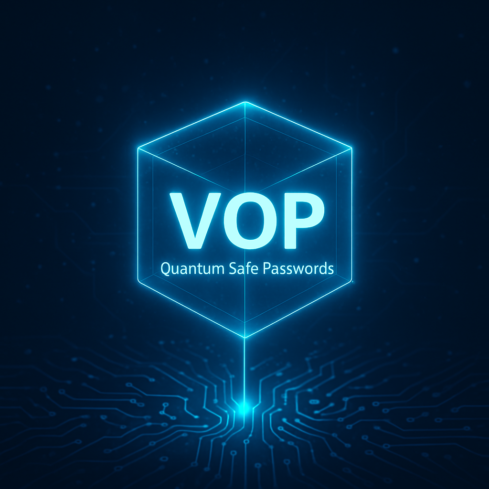

# vop

A password generator.

With this software, reasonably secure modern passwords can be generated.

Modern passwords have to be (preferably) a random sequence of characters, of sufficient length (minimally 8 usually) and should consist of at least one uppercase, one lowercase letter and one special character or more.

# Installation

The latest signed rpm or source package can be downloaded from:

[Release v1.4.0](https://github.com/MatthewBuchananAstley/vop/releases/tag/v-test-20250620-123916) 

First check the signature of the signed package.

Import the public signing key from the repository:

    curl https://raw.githubusercontent.com/MatthewBuchananAstley/vop/refs/heads/main/mbastley_github_signing_key.asc | gpg --import 

Or from the keys.openpgp.org keyserver with "keyserver hkps://keys.openpgp.org" in ~/.gnupg/gpg.conf:

    $gpg --search-keys "mbastley@gmail.com"
    gpg: data source: https://keys.openpgp.org:443
    (1)	M.B.Astley (Github Signing Key) <mbastley@gmail.com>
	  4096 bit RSA key B958339F1229A6EE, created: 2025-06-19
    Keys 1-1 of 1 for "mbastley@gmail.com".  Enter number(s), N)ext, or Q)uit > 1

    $gpg --verify vop-1.4.0-1.el9.noarch.rpm.sig vop-1.4.0-1.el9.noarch.rpm
    gpg: Signature made Fri 20 Jun 2025 12:01:00 CEST
    gpg:                using RSA key 5E3097F9AF5D0E9B1DB0641FB958339F1229A6EE
    gpg: Good signature from "M.B.Astley (Github Signing Key) <mbastley@gmail.com>" [ultimate]

    $sha256sum vop-1.4.0-1.el9.noarch.rpm
     fcacf549e19b7cdf1615e388dd920748a9ef7092f173f2cd23d43b8f6e24fafb
     sha256:fcacf549e19b7cdf1615e388dd920748a9ef7092f173f2cd23d43b8f6e24fafb

If the signatures are good the latest release can be installed on rpm based systems:

    $sudo rpm -ivh https://github.com/MatthewBuchananAstley/vop/releases/download/v-test-20250620-123916/vop-1.4.0-1.el9.noarch.rpm

Or the application can be downloaded via the git clone command:

    $git clone https://github.comm/MatthewBuchananAstley/vop.git

# Usage:

    ./vop 100 

The password length be an arbitrarily large number, however keep in mind that passwordfields in many cms databases are constrained to a certain amount of characters.

# Combining fractions of passwords from a list of generated passwords into a new password.

The pw script produces a list of between one and a hundred passwords from which a password can be chosen or combined into a new password with some added manual typing for extra security:

    ./pw 100 

# In need of more special characters? 

Say no more. Adding more special characters is now possible using the -s flag.

    ./vop -s 10 100

# Other uses 

The password can also be changed into an url friendly base64 string to prepend to a publicly accessible file on a webserver.

    ./vop 64 1

# Not enough special characters?

Here you go, you can use t3 to use the full character set. 

    ./t3 1000

This may cause strange behaviour in other tools such as incorrect character counts, see wc as an example.
If you want a correct character count use 

    ./t3 100 | python -c 'import sys; a = sys.stdin.read() ; print(len(a))'

# Testing entropy of the passwords 

At first glance the t3 results have more entropy, however some tests have a problem with the character set.

The following tests can be used to check for entropy

    Password_entropy_verifier.py 
    Chi-square_test.py
    Kolmogorov-Smirnov-test.py
    shannon_entropy.py
    
# Checking the quantum safety of your password

A password consisting of 256 bits of entropy is needed to be safe against brute force attacks on your password using quantum computers.

ACCORDING TO ChatGPT:

    Character Set Size	Bits/Char	Length for 256 bits
    256 (random bytes)	8		32 characters
    192			7.57		~33.8 characters
    128			7		~36.6 characters
    95 (printable ASCII)6.57		~39.0 characters
    62 (A–Z, a–z, 0–9)	5.95		~43.0 characters

However in reality ./t3.py 48 gives enough entropy, that is to reach at least 256 bits, and for ./vop the threshold seems 57 characters to consistently generate a quantum safe password. In other words try generating the password a few times if the test reports an insufficient amount of entropy. 

You can check the quantum safety of your passwords with Password_entropy_verifier.py:

    ./Password_entropy_verifier.py $(./t3 100) or $(./vop 100) or your own password

    Character distribution:
    ...
    Î: 1 (1.00%)
    B: 1 (1.00%)
    -: 2 (2.00%)
    ¤: 1 (1.00%)
    K: 2 (2.00%)
    S: 1 (1.00%)
    ...

    Nu­»Õçj(´~Éîȶ³Û}ä£8¸ÍÑXÜôìÒVsY2°}¶á×AÕ²uü4æh¿a,4!áoâÄ+Ì~Oí¸*Ó§Âà\ÝOÂdý=éñc¶¿ìѶË;aƳ+èÉ>mÎBì-¤KS-Kà

    Shannon Entropy: 6.1563 bits per character 

    QUANTUM SAFE PASSWORD!
   

    Total Entropy: 615.6307 bits (for 100 characters)

* 128 bit level means 2^128 operations which means that it takes so many attempts to crack the password that it will take quantum computers trillions of years
  
